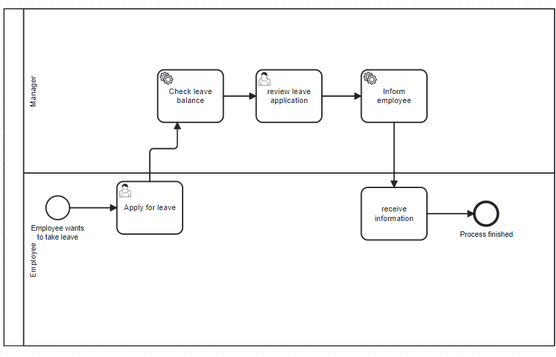

# Leave-manager
Application to manage employee leaves built using camunda and spring boot
# Process

The process starts by the employee applying for leave

The employee can choose start_date, end_date, leave_type ( sick leave or vacation ) , reason_for_leave and email.
Then we search for the leave balance of the employee by seaching the given email in the db

The employee can then accept or reject the leave based on the given informations

The employee is then informed about the manager decision by email.

# Email server configuration

In the google account settings search for app passwords

Then create new app and the new password will be generated

In the application.yaml put the email address and the generated password.

The used adress will be the sender email.

# CI/CD

For CI/CD github actions is used. The configuration is under .github/workflows/workflow.yaml
It is trigered by clicking on run workflow button

The pipeline first checkout the github repo , build the docker image then push it to docker hub.
The docker hub credentials are given as github secrets.

The docker image is defined under Dockerfile.
it build the project then run it and exposes port 8080.

# Infrastructure

Terraform is used to provision the AWS ec2 instance where the docker image will run.
The terraform configuration is under /infra/main.tf
It defines a EC2 t2.micro instance  which is free to use with the AWS free tier.
It also defines 2 Ingress rules one to allow ssh connection on port 22 for the EC2 Instance Connect service IP addresses in eu-central-1 and one to allow traffic only from the user ip address and one Egress rule to allow all outbound traffic.
It also creates the ec2 instance and install docker in it using user data.

# AWS Deployment

To run the app connect to the instance using EC2 Instance Connect  and run it.
sudo docker run -p 80:8080 mehdi127/leave-manager
Then open the ec2 instance address usign http protocol and not https.